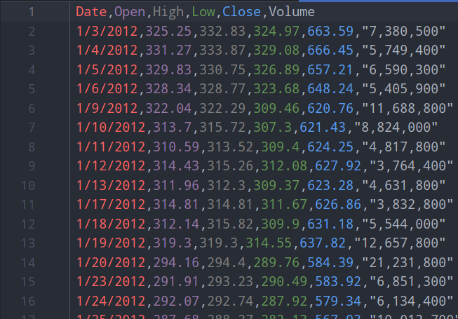
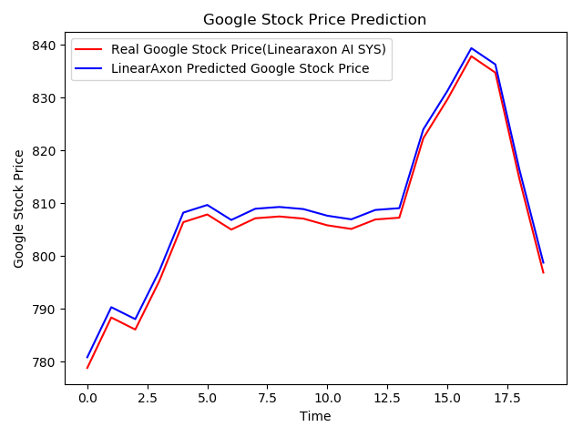

# Stock price Prediction

To predict what will be the next day's stock price at an accuracy
of about 97%. We have used Google Stock Price as training and test
data.
Below is a sample training data:

## Result

The model predicts the next day stock price at an accuracy of 98.7%.
Thr graph has been shown below.[Linearaxon was our AI StartUp venture]

## License

This project is licensed under the MIT License - see the [LICENSE.md](LICENSE.md) file for details
